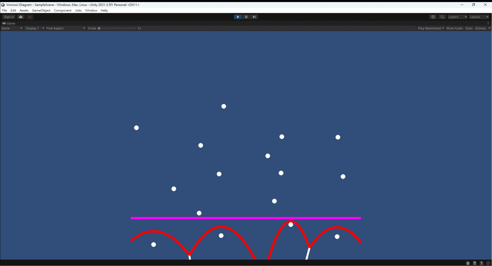

# 使用 Unity 實作 Voronoi Diagram

Unity Version: `2021.3.5f1`

## Demo Video (gif is link)

[](https://www.youtube.com/watch?v=HnCEBP4L-Y8)

## Fortune's Algorithm

Fortune’s Algorithm 尋找 Voronoi Diagram 的演算法之一，其原理是使用一根 Sweep Line (影片中紫色那條) 作為掃描線，從上往下或從下往上掃，當 Sweep Line 經過一個新的點，就加入以那個點做焦點，以 Sweep Line 做準線所畫出來的拋物線 Parabola。

當有兩個拋物線相交時，該交點移動的軌跡即可形成兩拋物線焦點之間的中垂線。因此我們會把每個拋物線接在一起，形成 Beach Line (影片中紅色那條)，而 Beach Line 上的每個轉折點就是拋物線與拋物線的交點，那些交點的移動即可形成中垂線 (影片中白色的線)

而我們要求的正是那些白色的線形成的圖，即是 Voronoi Diagram。

## Parabola Intersection Calculation

要計算兩拋物線的交點，首先必須先定義拋物線的公式，我上網查了一下高中數學，再根據我的應用是由下往上掃描，因此我的拋物線都是開口向下的。因此我們可以套用拋物線的標準式：

```
4*c*(y - k) = (x - h)^2
c = (L - f.y) / 2 : 拋物線的焦距，焦點到準線的距離，因為準線是水平的，因此準線即為 y 座標
L: 準線的 y 座標
h = f.x : 拋物線頂點的 x 座標，與焦點的 x 座標相同
k = f.y + c : 拋物線頂點的 y 座標，為焦點的 y 座標移動一個焦距 c
```

這邊簡單帶過，如果你把兩個拋物線求焦點其方程式如下：

```
AX^2 + BX + C = 0
A = c1 - c2
B = 2(c2h1 - c1h2)
C = (c1h2^2 - c2h1^2 + 4c1c2(k2 - k1))
```

接下來使用公式解救可以求得其焦點：

```
Δ = B^2 - 4AC
x = (-B ± √Δ) / 2A
```

當然判別式 `Δ` 要是正的才有解。

## Sweep Line

首先我們先使用 Sweep Line 掃描並做增加點的動作，並且要不斷更新各拋物線的準線。

此處可參考 VoronoiDiagram.RunScanY ，簡單來說就是當 Sweep Line 比一個點的 y 還高的時候，我就會把這個新的點提出來，並於待會進行 Point.SolvePoint 來新增以這個點作為焦點的拋物線。

這邊注意，平常沒有加入新的點的時候， Sweep Line 會按照自己的速度移動，但有加入新的點的時候，Sweep Line 會移到加入的那個點的同高度，目的是為了讓交點更精準。

## Beach Line

根據 Fortune’s Algorithm ，我們要先把 Beach Line 找出來，Beach Line 也就是我影片中紅色那條，可以想像是海岸線，海水退潮後就會看到下面真實的樣子，我覺得取這個名字還蠻貼切的。

此時有兩個狀況：

> 1. 加入新的點的時候，會將一個原有的拋物線切成兩半 (`Point.SolvePoint`)
> 2. 沒有加入新的點的時候，不斷計算並更新每條拋物線 (`Line.Update`)

這邊我的順序是，每新的一輪會先做 `Line.Update` 更新每一條線後，再做 `Point.SolvePoint` 考慮是不是有新的點加入。

### Point.SolvePoint

當新的點加入時，準線跟拋物線同高的狀況下是畫不出拋物線的。因此我們要先找每個拋物線在該點的 x 座標上的高度，並互相比較找出最高的那條。該條最高拋物線也就是即將跟新的拋物線相交的拋物線。(#19 ~ #40)

當找到最高的拋物線後，我們會將該條拋物線切開，把新的拋物線塞在中間。(#42 ~ #72)

### Line.Update

因為我的資料結構都有紀錄：目前這條拋物線的上一條拋物線與下一條拋物線各是誰。因此我就只需要針對上一條與下一條拋物線求焦點即可。(#85 ~ #115)

若求完交點算出新的 front point 比新的 to point 還後面，代表自己已經被前後兩條拋物線吞噬，則必須將自己刪除，刪除自己後還要把前後兩條拋物線接在一起，才不會導致錯誤。(#117 ~ #142)

## Conclusion

我覺得我寫的是真的有夠爛啦！感覺把一個簡單的東西複雜化了，寫得密密麻麻還不及人家簡潔，而且還有很多隱性 Bug 還沒修：實測後發現在點很多的狀況下還是會有一些問題(Beach Line 斷掉之類的)，但我已經懶得修了，大致上不會遇到太大的問題就好。

## Reference

本篇參考自阿祥的筆記，感謝阿祥，以下附上原篇連結。
